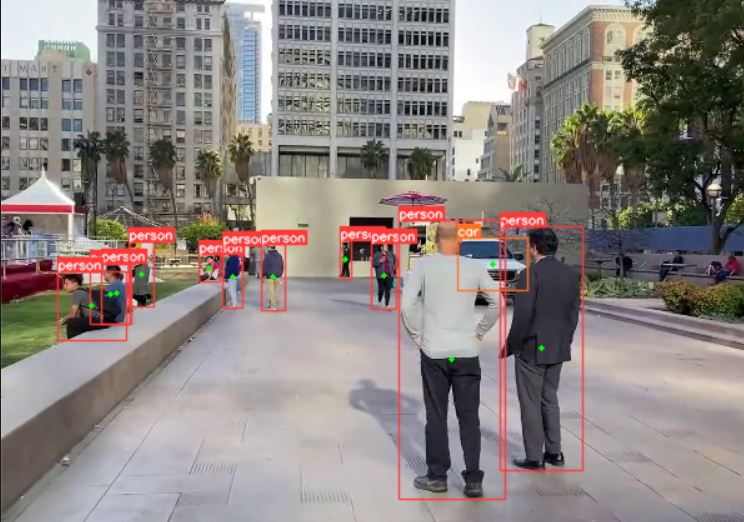
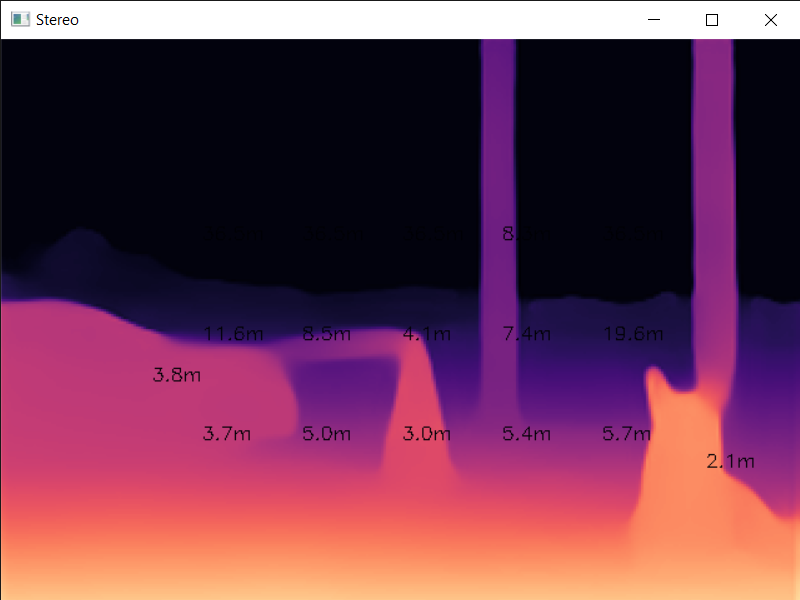
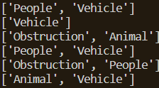

# Smartsight

## Overview
A python based application that aids visually impaired individuals with basic navigation with the help of computer vision technology. It utilizes object detection along with other image processing techniques to provide helpful information about the environment.  

The program works by recording video (frames) from a camera and passing the frames to different modules to obtain the required results.  

The program consists of the following modules:  
- **Obj_detect_v8.py** is used for object detection.  
- **Stereo_CUDA.py** is used for depth estimation.  
- **Audio_feedback.py** is used for generating and playing audio alerts.  
- **Combined_video.py** acts as a central pipeline to integrate the aforementioned modules and run it as a whole.  
- ~~Stereo_video.py is used to generate disparity maps using a left and a right frame through a block-matching algorithm.~~ (deprecated)

This program also runs on a server-client architecture with **server.py** and **client.py** (tested on localhost).  
The program averages around 16fps on a GTX 1050ti.

## Object Detection
Object detection uses the ultralytics [YOLOv8](https://github.com/ultralytics/ultralytics) model to detect object classes and provide bounding boxes.

## Depth Estimation
Depth estimation is performed using the Pytorch [MiDaS](https://pytorch.org/hub/intelisl_midas_v2/) model to generate depth maps and calculate distances.

## Audio Feedback
The information provided by these modules are used by the audio feedback module to generate the suitable alerts. The alerts are then played through text-to-speech.

# Usage/Inference
For a non-network based implementation, run **Combined_video.py**. For a networked implementation, use **Server.py** and **Client.py**.

Set the source in Combined_video.py and Client.py to the device index:  
`capture = cv2.VideoCapture(0)`  
We can also run inference on an **mp4** video file:  
`capture = cv2.VideoCapture("Test_video.mp4")`  

While the program (or client) is running, you can use the following controls:
- `a` to toggle alerts ON or OFF
- `q` to quit program (client)
